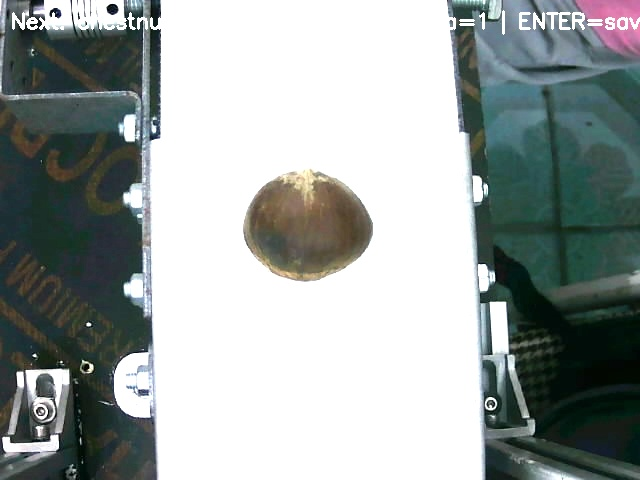
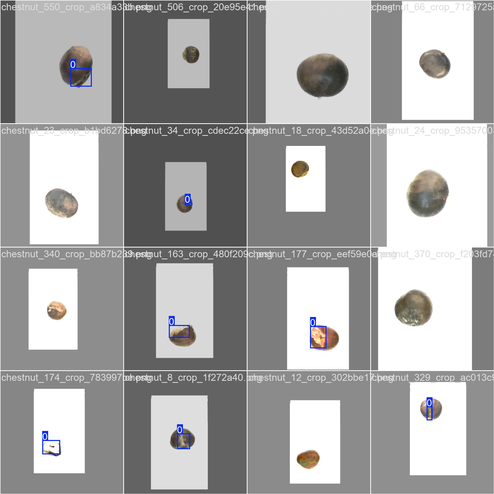
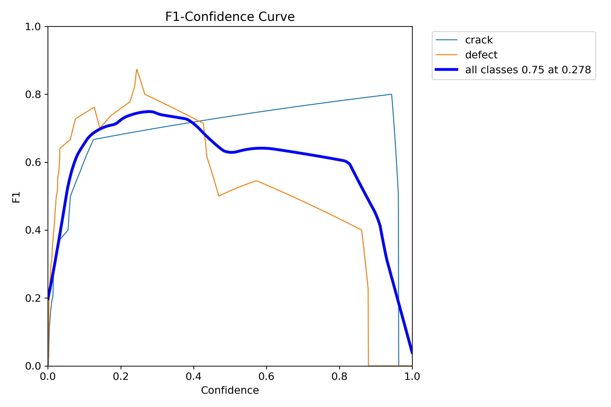

# 🥥 Chestnut Classification – Crack & Defect Detection (YOLO + Labelme)

This project focuses on automatically detecting **defective chestnuts** using computer vision and deep learning.
The pipeline covers the process from raw image → preprocessing → cropping → annotation → YOLO training → exporting `best.pt`.

---

## 🚀 Overall Pipeline


---

## 1️⃣ Collect RAW images & adjust brightness / contrast

Images were collected from a camera, then brightness/contrast were adjusted to improve visibility before cropping.

<p align="center">
  
  <br><em>Figure 1 — RAW image after brightness & contrast adjustment</em>
</p>

---

## 2️⃣ Crop ROI (Region of Interest)

Only the chestnut area is kept. Background noise is removed.

<p align="center">
  
  <br><em>Figure 2 — Cropped image (ROI extracted)</em>
</p>

---

## 3️⃣ Label data using Labelme (`crack` / `defect`)

Annotation is done using **Labelme** with two classes:

| Class   | Meaning                        |
|---------|-------------------------------|
| `crack` | Cracked surface               |
| `defect`| Deformed / broken chestnut    |

Convert Labelme JSON → YOLO format:

```bash
labelme2yolo --json_dir ./data/cropped --segmentation polygon

The output dataset structure should be:

datasets/chestnut/
├─ images/
│  ├─ train/
│  └─ val/
└─ labels/
   ├─ train/
   └─ val/

Train YOLO

python -m venv .venv
.venv\Scripts\activate      # Windows
pip install --upgrade pip
pip install ultralytics labelme opencv-python

Data configuration

datasets/chestnut/data.yaml
with content:
path: datasets/chestnut
train: images/train
val: images/val
nc: 2
names: [crack, defect]

Train YOLO

yolo task=detect mode=train model=yolov8n.pt data=datasets/chestnut/data.yaml \
     epochs=100 imgsz=640 batch=16 project=runs/train name=chestnut

After training, the model file will be located at:
runs/detect/chestnut/weights/best.pt

Run inference (prediction)

yolo task=detect mode=predict model=runs/detect/chestnut/weights/best.pt \
     source="samples/" save=True project=runs/predict name=chestnut_pred

Results will be saved to:

runs/predict/chestnut_pred/

## 3 Train batch


<p align="center">
  
  <br><em>Figure 3 — train_batch </em>
</p>

---

## 4 labels


<p align="center">
  
  <br><em>Figure 4 — labels </em>
</p>

---

## 5 labels


<p align="center">
  
  <br><em>Figure 5 — confusion_matrix_normalized </em>
</p>

---
## 6 BoxF1_curve


<p align="center">
  
  <br><em>Figure 6 — BoxF1_curve </em>
</p>

---
## 7 results


<p align="center">
  
  <br><em>Figure 7 — results </em>
</p>

---